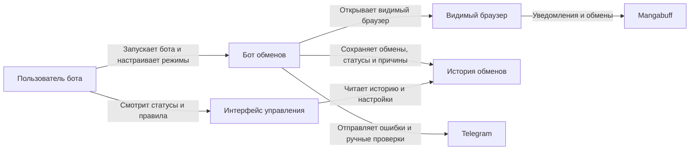

# Project Overview

## Название проекта

Автоматическое принятие обменов Mangabuff

## Описание проекта

Новый отдельный бот Mangabuff, который находит входящие обмены карт, открывает их в видимом браузере, анализирует карту, которую хотят получить у пользователя, применяет правила принятия и, при включённом рабочем режиме, принимает подходящие обмены.

Бот должен разрабатываться как самостоятельный продукт со своей авторизацией, настройками, хранилищем истории и экраном управления. Он не должен зависеть от других ботов или внешних модулей автоматизации.

Ключевой принцип: сначала бот безопасно читает и анализирует обмены, а автоматическое принятие включается только после проверки правил и работы безопасного режима.

## Основной сценарий использования

Пользователь запускает нового бота обменов Mangabuff, авторизуется в аккаунте и настраивает правила принятия. Если правила настроены, бот открывает обычное видимое окно браузера, переходит во вкладку уведомлений, фильтрует уведомления по обменам, открывает новые входящие обмены, определяет карту, которую хотят забрать, проверяет её страницу и раздел "Хотят получить", считает количество страниц желающих, применяет настроенные правила и сохраняет решение.

В безопасном режиме бот ничего не принимает автоматически: он показывает и сохраняет решение "бот бы принял" или "бот бы не принял". В рабочем режиме бот нажимает "Принять обмен" только если автоматическое принятие включено, правила настроены, обмен всё ещё доступен и проверка прошла успешно.

Если обмен не принят или требует ручной проверки, пользователь получает Telegram-уведомление с причиной. История обработанных обменов доступна в хранилище нового бота и на экране "Обмены" в его интерфейсе управления.

## Нефункциональные требования к системе

### Безопасность

- Бот обменов должен работать только в видимом браузере.
- Все переходы, прокрутки, клики, ожидания и страницы принятия должны быть видны пользователю.
- Для этой фичи запрещено принимать обмен прямым HTTP-запросом вместо видимого действия в браузере.
- В безопасном режиме бот не должен нажимать "Принять обмен".
- В рабочем режиме бот может нажать "Принять обмен" только после успешной проверки обмена по правилам.
- Бот не должен нажимать "Отклонить обмен"; неподходящий обмен нужно оставить без действия на сайте, сохранить причину и отправить Telegram-уведомление.
- Если правила принятия не настроены, бот должен считать это ошибкой конфигурации и не запускать обработку обменов.
- Если данных по обмену или карте не хватает, обмен должен уходить в ручную проверку.
- Токен Telegram-бота и ID чата должны храниться в настройках безопасно и не попадать в логи в открытом виде.
- Если Telegram не настроен, бот должен считать это ошибкой конфигурации и не запускать автоматическую обработку обменов.
- Бот должен иметь собственный сценарий авторизации и безопасно переиспользовать свою браузерную сессию.

### Локализация

- **Supported Languages**: русский.
- **Date/Currency Formats**: даты и время должны отображаться в формате, принятом в интерфейсе управления нового бота.
- **Regional Settings**: текст статусов, причин решений и Telegram-сообщений должен быть на русском языке.

### Доступность

- Экран "Обмены" в интерфейсе управления должен быть читаемым без обращения к техническим логам.
- Статусы обменов и причины решений должны быть представлены текстом, а не только цветом.
- Переключатели автоматического принятия и безопасного режима должны иметь понятные подписи.

### SEO

- Не применимо: функциональность является локальным инструментом и не требует индексации поисковыми системами.

---

# Бизнес цели

- Снизить ручную работу пользователя при обработке входящих обменов Mangabuff.
- Уменьшить риск случайного принятия невыгодного обмена через безопасный режим, историю и явные правила.
- Дать пользователю прозрачную картину: какие обмены бот нашёл, что проверил, какое решение принял и почему.

---

# Роли пользователей

- **Пользователь бота —** владелец аккаунта Mangabuff, который запускает бота, видит действия браузера, настраивает правила, получает Telegram-уведомления и принимает решение о включении автоматического режима.
- **Бот обменов —** системный исполнитель, который читает уведомления, открывает обмены, анализирует карты, применяет правила, сохраняет историю и при разрешении принимает обмен.
- **Разработчик / ИИ-агент —** участник разработки, который исследует сайт, реализует нового бота обменов, поддерживает правила и обновляет поведение при изменении страниц Mangabuff.

---

# Матрица прав доступа

| Функция | Пользователь бота | Бот обменов |
| ------- | ----------------- | ----------- |
| Просмотр действий в браузере | ✓ | ✓ |
| Настройка правил принятия | ✓ | - |
| Чтение уведомлений | ✓ | ✓ |
| Открытие страницы обмена | ✓ | ✓ |
| Анализ карты и раздела "Хотят получить" | ✓ | ✓ |
| Автоматическое принятие обмена | ✓ | ✓ |
| Включение безопасного режима | ✓ | - |
| Просмотр истории обменов | ✓ | ✓ |
| Получение Telegram-уведомлений | ✓ | - |

---

# Функциональные требования

## Epic - Автоматизация входящих обменов Mangabuff

- **id**: `EPIC-001`
- **description**: Новый бот должен находить входящие обмены Mangabuff, анализировать ценность карты, которую хотят получить у пользователя, сохранять историю решений, уведомлять пользователя о проблемах и принимать подходящие обмены только в видимом браузере и только после прохождения правил.

### Features

#### Feature - Исследование обменов на сайте

- **id**: `FEAT-001`
- **description**: Изучить страницы уведомлений и обменов Mangabuff, чтобы зафиксировать URL, признаки входящих обменов, структуру страницы обмена, элементы карт, статусы и безопасный способ будущего принятия.

##### Role

- **Название роли**: Разработчик / ИИ-агент
- **Ценность / цели**: Понять, как сайт показывает обмены и какие элементы можно использовать для безопасной автоматизации.
- **Ключевые сценарии**: открыть уведомления, включить фильтр обменов, изучить отменённые и активные обмены, найти кнопку принятия без нажатия, запросить разрешение на пробное принятие при необходимости.
- **Метрики успеха**: зафиксированы URL, признаки обменов, ID обмена, поля страницы, статусы ошибок и безопасный селектор кнопки принятия.

##### User Stories

- **id**: `STORY-001`
  - **story**: Как разработчик хочу изучить страницы уведомлений и обменов, чтобы реализовать бота без опасных предположений о структуре сайта.
  - **diagram**:
    ```mermaid
    sequenceDiagram
        participant Dev as Разработчик
        participant Site as Mangabuff
        Dev->>Site: Открывает уведомления и фильтр обменов
        Site->>Dev: Показывает список уведомлений
        Dev->>Site: Открывает страницу обмена
        Site->>Dev: Показывает статус, карты и действия
    ```

##### Feature Requirements

- **FR-001**: Основной URL уведомлений подтверждён в браузере: `https://mangabuff.ru/notifications`.
- **FR-002**: URL фильтра обменов подтверждён в браузере: `https://mangabuff.ru/notifications?type=trade`; в интерфейсе он доступен как ссылка "Обмены".
- **FR-003**: Признаки уведомлений обменов подтверждены: ссылка на пользователя, имя пользователя, текст события `отправил предложение на обмен` или `отменил предложение на обмен`, ссылка `просмотреть`, URL обмена вида `/trades/{tradeId}`, дата и время события.
- **FR-004**: Страницы обменов подтверждены в формате `https://mangabuff.ru/trades/{tradeId}`; ID обмена извлекается из последнего сегмента URL.
- **FR-005**: Активный обмен показывает отправителя, блоки карт и кнопки действий; отменённый обмен показывает текст `Обмен отменен`; недоступная страница обмена возвращает 404 с текстом `Страница не найдена`; уже обработанный обмен требует отдельной проверки на реальном примере.
- **FR-006**: На странице обмена подтверждены зоны данных: отправитель показан рядом с текстом `предлагает обмен`, предложенные карты находятся в блоке `Вам предлагают - N`, запрошенные карты находятся в блоке `Вы отдадите - N`, ссылки карт имеют вид `/cards/{cardId}/users`, статус может отображаться как `✅ Вы просмотрели` или `Обмен отменен`.
- **FR-007**: На активном обмене подтверждена кнопка `Принять обмен`; нажимать её без отдельного подтверждения пользователя запрещено.
- **FR-008**: На активном обмене подтверждены опасные действия рядом с принятием: кнопки `Отклонить обмен` и `Принять обмен`; бот не должен нажимать `Отклонить обмен`, отдельная кнопка отмены или встречного действия на проверенном входящем обмене не обнаружена.
- **FR-009**: Предварительно достаточно обычного видимого клика по кнопке `Принять обмен`, но фактический результат клика не подтверждён, потому что пробное принятие не выполнялось.
- **FR-010**: Пробное принятие конкретного обмена разрешено только после отдельного подтверждения пользователя; во время браузерной проверки принятие не выполнялось.

##### Acceptance criteria

- **id**: `AC-001`
  - **criteria**: Документировано, где искать обмены и как отличать входящее предложение от отмены или другого уведомления.
- **id**: `AC-002`
  - **criteria**: Документировано, как открыть конкретный обмен и какие данные нужны для анализа.
- **id**: `AC-003`
  - **criteria**: Кнопка принятия и опасные действия описаны без несанкционированного нажатия.
- **id**: `AC-004`
  - **criteria**: Если пробное принятие не выполнено, в документации есть явная пометка, что запрос принятия требует отдельной проверки.

#### Feature - Чтение вкладки "Уведомления"

- **id**: `FEAT-002`
- **description**: Бот должен регулярно заходить во вкладку "Уведомления" в видимом браузере и находить новые уведомления об обменах.

##### Role

- **Название роли**: Бот обменов
- **Ценность / цели**: Получать новые входящие обмены без ручного просмотра уведомлений пользователем.
- **Ключевые сценарии**: открыть уведомления в собственной авторизованной браузерной сессии, отфильтровать обмены, извлечь ссылки или ID, сохранить новые записи, не обрабатывать повторно старые.
- **Метрики успеха**: новые обмены попадают в историю один раз, повторные уведомления не запускают повторную обработку.

##### User Stories

- **id**: `STORY-002`
  - **story**: Как пользователь бота хочу, чтобы бот сам находил новые обмены в уведомлениях, чтобы не проверять вкладку вручную.
  - **diagram**:
    ```mermaid
    sequenceDiagram
        participant Bot as Бот
        participant Site as Mangabuff
        participant DB as История
        Bot->>Site: Открывает уведомления обменов
        Site->>Bot: Возвращает список уведомлений
        Bot->>DB: Сохраняет новые ID обменов
    ```

##### Feature Requirements

- **FR-011**: Бот должен открывать страницу уведомлений в видимом браузере.
- **FR-012**: Бот должен использовать собственную авторизованную браузерную сессию.
- **FR-013**: Бот должен искать только уведомления про обмены карт.
- **FR-014**: Для каждого найденного обмена бот должен сохранять ID обмена или ссылку.
- **FR-015**: Бот не должен повторно обрабатывать одно и то же уведомление или один и тот же обмен.
- **FR-016**: Для найденного обмена должны сохраняться дата обнаружения, статус обработки и причина решения.

##### Acceptance criteria

- **id**: `AC-005`
  - **criteria**: Переход на страницу уведомлений виден пользователю в браузере.
- **id**: `AC-006`
  - **criteria**: Новый обмен получает статус `новое`.
- **id**: `AC-007`
  - **criteria**: Уже сохранённый обмен не добавляется повторно после перезапуска бота.

#### Feature - Открытие конкретного обмена

- **id**: `FEAT-003`
- **description**: Бот должен открыть найденный обмен, определить участника обмена, карту, которую хотят забрать, и карты, которые предлагают взамен.

##### Role

- **Название роли**: Бот обменов
- **Ценность / цели**: Подготовить данные обмена для проверки правил и принятия решения.
- **Ключевые сценарии**: открыть ссылку обмена, распознать стороны обмена, извлечь карты, сохранить данные, отправить обмен на ручную проверку при нехватке данных.
- **Метрики успеха**: по каждому обработанному обмену сохранены участник, запрошенная карта, предложенные карты и статус разбора.

##### User Stories

- **id**: `STORY-003`
  - **story**: Как пользователь бота хочу, чтобы бот понимал состав обмена, чтобы решение принималось на основании конкретных карт.
  - **diagram**:
    ```mermaid
    sequenceDiagram
        participant Bot as Бот
        participant Trade as Страница обмена
        participant DB as История
        Bot->>Trade: Открывает обмен
        Trade->>Bot: Показывает пользователя и карты
        Bot->>DB: Сохраняет данные обмена
    ```

##### Feature Requirements

- **FR-017**: Бот должен открыть уведомление или ссылку конкретного обмена.
- **FR-018**: Бот должен определить пользователя, который предложил обмен.
- **FR-019**: Бот должен определить карту, которую хотят получить у пользователя.
- **FR-020**: Если у пользователя просят больше одной карты в одном обмене, бот должен остановить обработку этого обмена, не нажимать кнопки действий на сайте, сохранить причину и отправить Telegram-уведомление.
- **FR-021**: Бот должен определить карту или карты, которые предлагают взамен.
- **FR-022**: Все действия открытия и просмотра обмена должны выполняться в видимом браузере.
- **FR-023**: Если данные обмена не удалось определить, бот не должен принимать обмен.
- **FR-024**: При нехватке данных бот должен сохранить причину и отправить Telegram-уведомление.

##### Acceptance criteria

- **id**: `AC-008`
  - **criteria**: По обмену сохранены ссылка или ID, пользователь, запрошенная карта и предложенные карты.
- **id**: `AC-009`
  - **criteria**: Обмен с неполными данными получает статус `не принято` или `ошибка` с понятной причиной.
- **id**: `AC-010`
  - **criteria**: Бот не нажимает опасные действия во время разбора состава обмена.

#### Feature - Проверка карты, которую хотят забрать

- **id**: `FEAT-004`
- **description**: Бот должен открыть страницу запрошенной карты, перейти в раздел "Хотят получить" и посчитать количество страниц желающих.

##### Role

- **Название роли**: Бот обменов
- **Ценность / цели**: Оценить востребованность карты перед принятием обмена.
- **Ключевые сценарии**: перейти на страницу карты, открыть раздел "Хотят получить", посчитать страницы желающих, сохранить результат.
- **Метрики успеха**: для обмена сохранено количество страниц желающих или понятная причина, почему его не удалось посчитать.

##### User Stories

- **id**: `STORY-004`
  - **story**: Как пользователь бота хочу, чтобы бот проверял востребованность карты, которую у меня хотят забрать, чтобы не отдавать важные карты случайно.
  - **diagram**:
    ```mermaid
    sequenceDiagram
        participant Bot as Бот
        participant Card as Страница карты
        participant DB as История
        Bot->>Card: Открывает запрошенную карту
        Bot->>Card: Переходит в "Хотят получить"
        Card->>Bot: Показывает страницы желающих
        Bot->>DB: Сохраняет количество страниц
    ```

##### Feature Requirements

- **FR-025**: Бот должен проверять именно карту, которую хотят забрать у пользователя.
- **FR-026**: Переход на страницу карты должен быть виден пользователю.
- **FR-027**: Переход в раздел "Хотят получить" должен быть виден пользователю.
- **FR-028**: Бот должен посчитать количество страниц желающих у карты.
- **FR-029**: Если раздел "Хотят получить" не найден, обмен нельзя принимать автоматически.
- **FR-030**: Если количество страниц не удалось посчитать, обмен должен быть отправлен на ручную проверку.

##### Acceptance criteria

- **id**: `AC-011`
  - **criteria**: Для успешно проверенной карты сохранено количество страниц желающих.
- **id**: `AC-012`
  - **criteria**: Ошибка поиска раздела или подсчёта страниц блокирует автоматическое принятие.
- **id**: `AC-013`
  - **criteria**: Пользователь видит переходы на страницу карты и раздел "Хотят получить".

#### Feature - Правила принятия обмена

- **id**: `FEAT-005`
- **description**: Система должна иметь настраиваемое место для правил, по которым бот решает, можно ли принять обмен автоматически.

##### Role

- **Название роли**: Пользователь бота
- **Ценность / цели**: Контролировать, какие обмены можно принимать автоматически, а какие всегда требуют ручной проверки.
- **Ключевые сценарии**: настроить минимальное количество страниц желающих, заблокировать запуск обработки обменов при отсутствии правил.
- **Метрики успеха**: без настроенных правил бот не запускает обработку обменов; с правилами каждое решение имеет объяснимую причину.

##### User Stories

- **id**: `STORY-005`
  - **story**: Как пользователь бота хочу настраивать правила принятия обменов, чтобы бот действовал по понятным ограничениям.
  - **diagram**:
    ```mermaid
    sequenceDiagram
        participant User as Пользователь
        participant Settings as Настройки
        participant Bot as Бот
        User->>Settings: Настраивает правила
        Bot->>Settings: Читает правила
        Bot->>Bot: Принимает решение по обмену
    ```

##### Feature Requirements

- **FR-031**: Если правила принятия не настроены, бот должен показать ошибку конфигурации и не запускать обработку обменов.
- **FR-032**: Правила должны поддерживать минимальное количество страниц желающих у карты.
- **FR-033**: Правила должны поддерживать список карт, которые можно отдавать автоматически.
- **FR-034**: Правила должны быть расширяемыми для разных рангов карт.
- **FR-035**: Каждое решение по правилам должно сохранять причину.

##### Acceptance criteria

- **id**: `AC-014`
  - **criteria**: Если правила принятия не настроены, бот показывает ошибку конфигурации и не запускает обработку обменов.
- **id**: `AC-015`
  - **criteria**: Если карта не входит в список карт для автоматической отдачи, обмен не принимается и причина видна в истории.
- **id**: `AC-016`
  - **criteria**: При прохождении правил бот может перейти к safe mode или рабочему принятию в зависимости от режима.

#### Feature - Автоматическое принятие обмена

- **id**: `FEAT-006`
- **description**: В рабочем режиме бот должен принять обмен видимым кликом по кнопке "Принять обмен", если обмен прошёл все проверки.

##### Role

- **Название роли**: Бот обменов
- **Ценность / цели**: Сократить ручное принятие безопасных обменов.
- **Ключевые сценарии**: вернуться на страницу обмена, проверить доступность, нажать кнопку, проверить результат сайта, сохранить статус.
- **Метрики успеха**: подходящие обмены принимаются, результат действия сохраняется, ошибки фиксируются и отправляются пользователю.

##### User Stories

- **id**: `STORY-006`
  - **story**: Как пользователь бота хочу, чтобы бот принимал подходящие обмены сам, чтобы не выполнять однотипные действия вручную.
  - **diagram**:
    ```mermaid
    sequenceDiagram
        participant Bot as Бот
        participant Trade as Страница обмена
        participant DB as История
        Bot->>Trade: Проверяет доступность обмена
        Bot->>Trade: Нажимает "Принять обмен"
        Trade->>Bot: Показывает результат
        Bot->>DB: Сохраняет статус
    ```

##### Feature Requirements

- **FR-036**: Автоматическое принятие должно быть доступно только при включённом рабочем режиме.
- **FR-037**: Перед нажатием бот должен проверить, что обмен всё ещё доступен.
- **FR-038**: Нажатие "Принять обмен" должно выполняться только в видимом браузере.
- **FR-039**: Бот должен проверить ответ сайта после нажатия.
- **FR-040**: Если обмен принят, бот должен сохранить статус `принят`, дату и время.
- **FR-041**: Если обмен не принят, бот должен сохранить статус `не принято` или `ошибка` и причину.
- **FR-042**: При ошибке принятия бот должен отправить Telegram-уведомление.
- **FR-043**: Если обмен не подходит по правилам, бот не должен нажимать `Отклонить обмен`; он должен оставить обмен на сайте без действия, сохранить причину и отправить Telegram-уведомление.

##### Acceptance criteria

- **id**: `AC-017`
  - **criteria**: Бот не принимает обмен при выключенном автоматическом режиме.
- **id**: `AC-018`
  - **criteria**: Успешное принятие сохраняет статус, дату и ссылку на обмен.
- **id**: `AC-019`
  - **criteria**: Ошибка или недоступность обмена блокирует повторное опасное действие без новой проверки.

#### Feature - Telegram-уведомления

- **id**: `FEAT-007`
- **description**: Пользователь должен получать Telegram-сообщение, когда обмен не принят, требует ручной проверки или произошла ошибка.

##### Role

- **Название роли**: Пользователь бота
- **Ценность / цели**: Быстро узнавать о проблемных обменах без постоянного просмотра интерфейса управления.
- **Ключевые сценарии**: настроить токен и ID чата, получить сообщение о непринятом обмене, увидеть понятную причину.
- **Метрики успеха**: каждое непринятие или ошибка отправляет понятное Telegram-сообщение.

##### User Stories

- **id**: `STORY-007`
  - **story**: Как пользователь бота хочу получать Telegram-уведомления о непринятых обменах, чтобы быстро проверять спорные случаи.
  - **diagram**:
    ```mermaid
    sequenceDiagram
        participant Bot as Бот
        participant Telegram as Telegram
        participant User as Пользователь
        Bot->>Telegram: Отправляет причину непринятия
        Telegram->>User: Показывает сообщение
    ```

##### Feature Requirements

- **FR-044**: В настройках должны быть токен Telegram-бота и ID чата.
- **FR-045**: Бот должен отправлять сообщение, если обмен не принят.
- **FR-046**: Сообщение должно объяснять причину простыми словами.
- **FR-047**: Нужно поддержать причины: карта не прошла правила, не удалось открыть обмен, не удалось посчитать желающих, сайт изменил страницу или вернул ошибку.
- **FR-048**: Позже можно добавить сообщение об успешно принятом обмене, кнопку "Открыть обмен" и безопасное ручное подтверждение.

##### Acceptance criteria

- **id**: `AC-020`
  - **criteria**: Непринятый обмен отправляет Telegram-сообщение.
- **id**: `AC-021`
  - **criteria**: Сообщение содержит ID или ссылку обмена и понятную причину.
- **id**: `AC-022`
  - **criteria**: Если Telegram не настроен, бот показывает ошибку конфигурации и не запускает автоматическую обработку обменов.

#### Feature - История обменов

- **id**: `FEAT-008`
- **description**: Система должна сохранять историю обработанных обменов, чтобы пользователь видел решения бота, а бот не повторял обработку после перезапуска.

##### Role

- **Название роли**: Пользователь бота
- **Ценность / цели**: Проверять работу бота, понимать причины решений и исключать повторные действия.
- **Ключевые сценарии**: сохранить найденный обмен, обновить статус после анализа, сохранить количество страниц желающих, причину решения и факт Telegram-уведомления.
- **Метрики успеха**: история содержит достаточно данных для проверки каждого решения и дедупликации обменов.

##### User Stories

- **id**: `STORY-008`
  - **story**: Как пользователь бота хочу видеть историю обменов, чтобы понимать, что бот уже обработал и почему принял или не принял обмен.
  - **diagram**:
    ```mermaid
    sequenceDiagram
        participant Bot as Бот
        participant DB as История
        participant User as Пользователь
        Bot->>DB: Записывает обработку обмена
        User->>DB: Открывает историю
        DB->>User: Показывает статус и причину
    ```

##### Feature Requirements

- **FR-049**: История должна хранить ID обмена или ссылку.
- **FR-050**: История должна хранить дату обнаружения.
- **FR-051**: История должна хранить пользователя, который предложил обмен.
- **FR-052**: История должна хранить карту, которую хотят забрать.
- **FR-053**: История должна хранить карту или карты, которые предлагают.
- **FR-054**: История должна хранить количество страниц желающих.
- **FR-055**: История должна хранить решение бота и причину решения.
- **FR-056**: История должна хранить, была ли отправка в Telegram.

##### Acceptance criteria

- **id**: `AC-023`
  - **criteria**: После обработки обмена в истории есть все доступные данные и финальный статус.
- **id**: `AC-024`
  - **criteria**: История используется для защиты от повторной обработки одного обмена.
- **id**: `AC-025`
  - **criteria**: Причина решения понятна без чтения технических логов.

#### Feature - Экран "Обмены" в интерфейсе управления

- **id**: `FEAT-009`
- **description**: Интерфейс управления нового бота должен получить экран "Обмены" для просмотра последних обменов, статусов, причин решений и управления режимами.

##### Role

- **Название роли**: Пользователь бота
- **Ценность / цели**: Управлять ботом обменов и видеть его работу без технических логов.
- **Ключевые сценарии**: открыть список последних обменов, увидеть статус и причину, перейти к обмену или карте, включить автоматическое принятие, включить режим "Только проверять".
- **Метрики успеха**: пользователь может оценить работу бота и поменять режим из интерфейса управления.

##### User Stories

- **id**: `STORY-009`
  - **story**: Как пользователь бота хочу экран "Обмены" в интерфейсе управления, чтобы контролировать работу нового бота из одного места.
  - **diagram**:
    ```mermaid
    sequenceDiagram
        participant User as Пользователь
        participant Panel as Интерфейс управления
        participant DB as История
        User->>Panel: Открывает экран "Обмены"
        Panel->>DB: Запрашивает последние обмены
        DB->>Panel: Возвращает статусы и причины
        Panel->>User: Показывает список и настройки
    ```

##### Feature Requirements

- **FR-057**: Экран должен показывать список последних обменов.
- **FR-058**: Для каждого обмена должны отображаться статус, причина решения и количество страниц желающих.
- **FR-059**: Для каждого обмена должна быть ссылка на обмен или карту, если она доступна.
- **FR-060**: Экран должен иметь переключатель "Автоматически принимать обмены".
- **FR-061**: Экран должен иметь режим "Только проверять, не принимать".
- **FR-062**: Статусы и причины должны быть понятны без чтения логов.

##### Acceptance criteria

- **id**: `AC-026`
  - **criteria**: Пользователь видит последние обмены, их статусы и причины решений.
- **id**: `AC-027`
  - **criteria**: Пользователь может включить или выключить автоматическое принятие.
- **id**: `AC-028`
  - **criteria**: Пользователь может включить безопасный режим проверки без принятия.

#### Feature - Безопасный режим

- **id**: `FEAT-010`
- **description**: Бот должен иметь режим проверки, в котором он выполняет весь анализ обменов, но не нажимает "Принять обмен".

##### Role

- **Название роли**: Пользователь бота
- **Ценность / цели**: Проверить корректность решений бота перед включением настоящего автоматического принятия.
- **Ключевые сценарии**: читать уведомления, открывать обмены, проверять карты, применять правила, сохранять результат "бот бы принял" или "бот бы не принял".
- **Метрики успеха**: несколько дней безопасной проверки показывают, что бот оценивает обмены корректно.

##### User Stories

- **id**: `STORY-010`
  - **story**: Как пользователь бота хочу безопасный режим, чтобы проверить решения бота до включения настоящего принятия обменов.
  - **diagram**:
    ```mermaid
    sequenceDiagram
        participant Bot as Бот
        participant Trade as Обмен
        participant DB as История
        Bot->>Trade: Анализирует обмен
        Bot->>Bot: Применяет правила
        Bot->>DB: Сохраняет "бот бы принял" или "бот бы не принял"
    ```

##### Feature Requirements

- **FR-063**: В безопасном режиме бот должен читать уведомления.
- **FR-064**: В безопасном режиме бот должен открывать обмены.
- **FR-065**: В безопасном режиме бот должен проверять карты и считать страницы желающих.
- **FR-066**: В безопасном режиме бот должен применять правила.
- **FR-067**: В безопасном режиме бот не должен нажимать "Принять обмен".
- **FR-068**: В безопасном режиме бот должен сохранять решение "бот бы принял" или "бот бы не принял".
- **FR-069**: Все действия безопасного режима должны быть видны пользователю в браузере.
- **FR-070**: Переход к рабочему режиму допускается после проверки правил и подтверждения пользователя.

##### Acceptance criteria

- **id**: `AC-029`
  - **criteria**: В безопасном режиме ни один обмен не принимается автоматически.
- **id**: `AC-030`
  - **criteria**: История показывает, какое решение бот принял бы в рабочем режиме.
- **id**: `AC-031`
  - **criteria**: Рабочий режим нельзя включить случайно из-за отсутствия правил или подтверждения пользователя.

## Diagram



---

# Порядок разработки

1. Исследовать страницу уведомлений и страницу обмена.
2. Научить бота читать уведомления.
3. Научить бота открывать обмен.
4. Научить бота находить карту, которую хотят забрать.
5. Научить бота проверять раздел "Хотят получить".
6. Добавить сохранение истории.
7. Добавить Telegram-уведомления.
8. Добавить безопасный режим.
9. Добавить правила принятия обмена.
10. Добавить настоящее принятие обмена.
11. Добавить экран "Обмены" в интерфейс управления нового бота.

---

# Открытые вопросы

1. Какие именно критерии считать подходящими для принятия обмена.
2. Сколько страниц желающих достаточно для автоматического принятия.
3. Какие карты можно отдавать автоматически.
4. Нужно ли уведомлять Telegram об успешно принятом обмене.
5. Нужно ли добавлять ручное подтверждение через Telegram.
6. Как часто бот должен проверять уведомления.

---

# References

- `prd-template.md` — структура PRD-документа.
- Браузерная проверка Mangabuff от 13 мая 2026: `https://mangabuff.ru/notifications`, `https://mangabuff.ru/notifications?type=trade`, активный обмен `https://mangabuff.ru/trades/77617719`, отменённый обмен `https://mangabuff.ru/trades/77575960`, недоступный обмен `https://mangabuff.ru/trades/1`.

---

# AI Checklist

> Следовать инструкциям документа `.spec-core/llms.md`

- [ ] Уточнений не требуется (нет нечётких формулировок и неясностей), пометки, требующие уточнений, обработаны и удалены.
- [ ] Документ согласован со всеми элементами из блока References.
- [ ] Последние изменения прогнаны через `/review` > 1 раза; флаг снят перед запуском и выставлен заново через команду `/review`.
