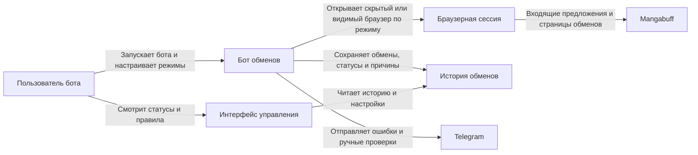

# Project Overview

## Название проекта

Автоматическое принятие обменов Mangabuff

## Описание проекта

Новый отдельный бот Mangabuff, который находит входящие обмены карт, открывает их через собственную браузерную сессию, анализирует карту, которую хотят получить у пользователя, применяет правила принятия и, при включённом рабочем режиме, принимает подходящие обмены.

Бот должен разрабатываться как самостоятельный продукт со своей авторизацией, настройками, хранилищем истории и экраном управления. Он не должен зависеть от других ботов или внешних модулей автоматизации.

Ключевой принцип: сначала бот безопасно читает и анализирует обмены, а автоматическое принятие включается только после проверки правил и работы безопасного режима. Видимый браузер обязателен только для разработки, диагностики и ручной проверки. В production-режиме бот использует скрытый браузер, но все действия проходят через браузерную сессию, а не прямыми HTTP-запросами.

## Основной сценарий использования

Пользователь запускает нового бота обменов Mangabuff, авторизуется в аккаунте и настраивает правила принятия. Если правила настроены, бот открывает скрытый браузер в production-режиме или видимый браузер в режиме разработки/диагностики, переходит на страницу входящих обменов `https://mangabuff.ru/trades`, читает вкладку "Предложения" и последовательно обрабатывает все видимые обмены на странице. После обработки всех видимых обменов бот обновляет страницу в браузере, потому что новые обмены не появляются в реальном времени без перезагрузки страницы.

После запуска бот должен работать постоянно, пока пользователь явно не остановит его или пока не потребуется повторная авторизация Mangabuff. Временные ошибки загрузки страницы, включая `505`, не должны останавливать цикл.

Для каждого обмена бот сначала определяет количество карт, которые хотят забрать у пользователя. Если хотят забрать больше одной карты, бот отправляет обмен на ручную проверку: прекращает дальнейшую обработку только этого обмена, не выполняет дополнительные проверки, не нажимает кнопки действий на сайте, сохраняет причину, отправляет Telegram-уведомление и переходит к следующему обмену. Если запрошена одна карта, бот открывает страницу этой карты, проверяет раздел "Хотят получить" и считает количество страниц желающих. Если количество страниц желающих не соответствует настроенным требованиям, бот бросает обмен по правилам и отправляет Telegram-уведомление. Если требование по страницам выполнено, бот возвращается к обмену и проверяет ранги всех карт: запрошенной карты пользователя и всех карт, которые предлагают взамен.

В безопасном режиме бот ничего не принимает автоматически: он сохраняет решение "бот бы принял" только для обменов, которые полностью прошли правила, а любые сомнения, непрохождение правил или неоднозначные случаи отправляет на ручную проверку. В рабочем режиме бот нажимает "Принять обмен" только если автоматическое принятие включено, правила настроены, обмен всё ещё доступен и проверка прошла успешно. После нажатия "Принять обмен" бот должен также нажать браузерное или сайтом показанное подтверждение принятия, если оно появилось.

Если обмен не принят или требует ручной проверки, пользователь получает Telegram-уведомление с причиной. История обработанных обменов доступна в хранилище нового бота и на экране "Обмены" в его интерфейсе управления.

История обменов является отдельным источником правды и хранит все обработанные обмены, включая принятые и непринятые. Telegram не заменяет историю и используется только для проблемных случаев. Успешно принятые обмены и решения safe mode "бот бы принял" отображаются в истории, но не отправляются в Telegram.

## Нефункциональные требования к системе

### Безопасность

- В production-режиме бот обменов должен работать в скрытом браузере.
- Видимый браузер должен использоваться для разработки, диагностики и ручной проверки.
- Все переходы, прокрутки, клики, ожидания и страницы принятия должны выполняться через браузерную сессию.
- Для этой фичи запрещено принимать обмен прямым HTTP-запросом вместо действия через браузерную сессию.
- В безопасном режиме бот не должен нажимать "Принять обмен".
- В рабочем режиме бот может нажать "Принять обмен" только после успешной проверки обмена по правилам.
- Бот не должен нажимать "Отклонить обмен"; неподходящий обмен нужно оставить без действия на сайте, сохранить причину и отправить Telegram-уведомление.
- Если требование описывает "бросить обмен", это означает остановить обработку только этого обмена, не выполнять по нему дальнейшие проверки, не нажимать кнопки действий на сайте, сохранить причину, отправить Telegram-уведомление и перейти к следующему обмену.
- Если правила принятия не настроены, бот должен считать это ошибкой конфигурации и не запускать обработку обменов.
- Если данных по обмену, карте, страницам желающих или рангам не хватает из-за технической ошибки, бот должен поставить статус `ошибка_проверки` и сохранить причину без Telegram-уведомления.
- Статус `ошибка_проверки` не является финальным до исчерпания попыток. Бот должен выполнить не больше 2 попыток обработки обмена, включая первую.
- Повторная попытка для `ошибка_проверки` обязательна, если обмен снова встретился в следующем обычном проходе вкладки "Предложения"; отдельный таймер повторов не нужен.
- После второй технической ошибки бот должен поставить финальный статус `требует_ручной_проверки`, отправить Telegram-уведомление и больше не обрабатывать этот обмен.
- Токен Telegram-бота и ID чата должны храниться в настройках безопасно и не попадать в логи в открытом виде.
- Если Telegram не настроен, бот должен считать это ошибкой конфигурации и не запускать автоматическую обработку обменов.
- Бот должен иметь собственный сценарий авторизации и безопасно переиспользовать свою браузерную сессию.
- Авторизация Mangabuff выполняется вручную в видимом браузере через отдельное действие входа; пароль Mangabuff бот не хранит.
- Если сессия Mangabuff протухла, бот должен сразу остановить обработку, сохранить ошибку авторизации и отправить Telegram-уведомление `Нужно заново войти в Mangabuff`.
- После ручного повторного входа в Mangabuff бот не должен сам возобновлять обработку; пользователь должен явно нажать запуск бота заново.
- Финальные статусы не должны обрабатываться повторно: `брошен_по_правилам`, `бот_бы_принял`, `требует_ручной_проверки`, `неактуален`. Исключение: статус `принят` можно проверить повторно, если этот же обмен снова появился во вкладке "Предложения".
- Статус `принят` ставится после того, как бот нажал "Принять обмен", нажал подтверждение принятия при его появлении и увидел на странице обмена текст `Обмен принят`.
- Если обмен со статусом `принят` снова появился во вкладке "Предложения", бот должен повторно проверить обмен целиком и при успешной проверке выполнить вторую попытку принятия. Если после двух попыток принятия обмен снова возвращается в "Предложения" или результат принятия не подтверждён, бот должен поставить статус `требует_ручной_проверки` и отправить Telegram-уведомление.
- Бот должен работать только с актуальными обменами, которые видны во вкладке "Предложения"; если обмен исчез из вкладки, бот не должен открывать его страницу для дополнительной проверки.
- Если обмен со статусом `новое` или `ошибка_проверки` исчез из вкладки "Предложения", бот должен поставить финальный статус `неактуален` без Telegram-уведомления.
- Если обмен со статусом `неактуален` снова появился во вкладке "Предложения", бот не должен обрабатывать его повторно и не должен отправлять Telegram-уведомление.
- Финальные статусы не меняются задним числом, если обмен позже исчез из вкладки "Предложения".

### Локализация

- **Supported Languages**: русский.
- **Date/Currency Formats**: даты и время должны отображаться в формате, принятом в интерфейсе управления нового бота.
- **Regional Settings**: текст статусов, причин решений и Telegram-сообщений должен быть на русском языке.

### Доступность

- Экран "Обмены" в интерфейсе управления должен быть читаемым без обращения к техническим логам.
- Статусы обменов и причины решений должны быть представлены текстом, а не только цветом.
- Переключатели автоматического принятия и безопасного режима должны иметь понятные подписи.

### SEO

- Не применимо: функциональность является локальным инструментом и не требует индексации поисковыми системами.

---

# Бизнес цели

- Снизить ручную работу пользователя при обработке входящих обменов Mangabuff.
- Уменьшить риск случайного принятия невыгодного обмена через безопасный режим, историю и явные правила.
- Дать пользователю прозрачную картину: какие обмены бот нашёл, что проверил, какое решение принял и почему.

---

# Роли пользователей

- **Пользователь бота —** владелец аккаунта Mangabuff, который запускает бота, может видеть действия браузера в режиме разработки/диагностики, настраивает правила, получает Telegram-уведомления и принимает решение о включении автоматического режима.
- **Бот обменов —** системный исполнитель, который читает входящие предложения обмена на странице `https://mangabuff.ru/trades`, открывает обмены, анализирует карты, применяет правила, сохраняет историю и при разрешении принимает обмен.
- **Разработчик / ИИ-агент —** участник разработки, который исследует сайт, реализует нового бота обменов, поддерживает правила и обновляет поведение при изменении страниц Mangabuff.

---

# Матрица прав доступа

| Функция | Пользователь бота | Бот обменов |
| ------- | ----------------- | ----------- |
| Просмотр действий в браузере в режиме разработки/диагностики | ✓ | ✓ |
| Настройка правил принятия | ✓ | - |
| Чтение входящих предложений обмена | ✓ | ✓ |
| Открытие страницы обмена | ✓ | ✓ |
| Анализ карты и раздела "Хотят получить" | ✓ | ✓ |
| Автоматическое принятие обмена | ✓ | ✓ |
| Включение безопасного режима | ✓ | - |
| Просмотр истории обменов | ✓ | ✓ |
| Получение Telegram-уведомлений | ✓ | - |

---

# Функциональные требования

## Epic - Автоматизация входящих обменов Mangabuff

- **id**: `EPIC-001`
- **description**: Новый бот должен находить входящие обмены Mangabuff, анализировать ценность карты, которую хотят получить у пользователя, сохранять историю решений, уведомлять пользователя о проблемах и принимать подходящие обмены через браузерную сессию и только после прохождения правил. В production используется скрытый браузер, а видимый браузер используется для разработки, диагностики и ручной проверки.

### Features

#### Feature - Исследование обменов на сайте

- **id**: `FEAT-001`
- **description**: Изучить страницу входящих обменов Mangabuff и страницы конкретных обменов, чтобы зафиксировать URL, признаки входящих обменов, структуру страницы обмена, элементы карт, статусы и безопасный способ будущего принятия.

##### Role

- **Название роли**: Разработчик / ИИ-агент
- **Ценность / цели**: Понять, как сайт показывает обмены и какие элементы можно использовать для безопасной автоматизации.
- **Ключевые сценарии**: открыть страницу `https://mangabuff.ru/trades`, изучить вкладку "Предложения", изучить отменённые и активные обмены, найти кнопку принятия без нажатия, запросить разрешение на пробное принятие при необходимости.
- **Метрики успеха**: зафиксированы URL, признаки обменов, ID обмена, поля страницы, статусы ошибок и безопасный селектор кнопки принятия.

##### User Stories

- **id**: `STORY-001`
  - **story**: Как разработчик хочу изучить страницу входящих обменов и страницы конкретных обменов, чтобы реализовать бота без опасных предположений о структуре сайта.
  - **diagram**:
    ```mermaid
    sequenceDiagram
        participant Dev as Разработчик
        participant Site as Mangabuff
        Dev->>Site: Открывает /trades и вкладку Предложения
        Site->>Dev: Показывает список входящих предложений обмена
        Dev->>Site: Открывает страницу обмена
        Site->>Dev: Показывает статус, карты и действия
    ```

##### Feature Requirements

- **FR-001**: Основной URL входящих обменов подтверждён в браузере: `https://mangabuff.ru/trades`.
- **FR-002**: В интерфейсе сайта входящие обмены находятся в разделе обменов на вкладке "Предложения"; рядом доступны вкладки "Отправленные" и "История обмена".
- **FR-003**: Признаки входящего предложения обмена подтверждены: ссылка на пользователя, имя пользователя, текст `Предложение обмена`, URL обмена вида `/trades/{tradeId}`, дата и время предложения.
- **FR-004**: Страницы обменов подтверждены в формате `https://mangabuff.ru/trades/{tradeId}`; ID обмена извлекается из последнего сегмента URL.
- **FR-005**: Активный обмен показывает отправителя, блоки карт и кнопки действий; отменённый обмен показывает текст `Обмен отменен`; недоступная страница обмена возвращает 404 с текстом `Страница не найдена`; уже обработанный обмен требует отдельной проверки на реальном примере.
- **FR-006**: На странице обмена подтверждены зоны данных: отправитель показан рядом с текстом `предлагает обмен`, предложенные карты находятся в блоке `Вам предлагают - N`, запрошенные карты находятся в блоке `Вы отдадите - N`, ссылки карт имеют вид `/cards/{cardId}/users`, статус может отображаться как `✅ Вы просмотрели` или `Обмен отменен`.
- **FR-007**: На активном обмене подтверждена кнопка `Принять обмен`; нажимать её без отдельного подтверждения пользователя запрещено.
- **FR-008**: На активном обмене подтверждены опасные действия рядом с принятием: кнопки `Отклонить обмен` и `Принять обмен`; бот не должен нажимать `Отклонить обмен`, отдельная кнопка отмены или встречного действия на проверенном входящем обмене не обнаружена.
- **FR-009**: По коду сайта подтверждено, что клик по `Принять обмен` сначала открывает модальное подтверждение сайта `Принять обмен?` с текстом `После подтверждения обмен будет завершён.`, кнопками `Принять` и `Отмена`; это не браузерный `confirm`.
- **FR-010**: Пробное принятие конкретного обмена разрешено только после отдельного подтверждения пользователя; во время браузерной проверки принятие не выполнялось.
- **FR-010a**: По коду сайта подтверждено, что фактическое принятие выполняется только после подтверждения в модальном окне через запрос `/trades/{tradeId}/accept`; фактический результат запроса не проверялся, потому что пробное принятие не выполнялось.

##### Acceptance criteria

- **id**: `AC-001`
  - **criteria**: Документировано, что входящие обмены нужно искать на `https://mangabuff.ru/trades` во вкладке "Предложения", и как отличать входящее предложение от уже обработанного, отменённого или недоступного обмена.
- **id**: `AC-002`
  - **criteria**: Документировано, как открыть конкретный обмен и какие данные нужны для анализа.
- **id**: `AC-003`
  - **criteria**: Кнопка принятия и опасные действия описаны без несанкционированного нажатия.
- **id**: `AC-004`
  - **criteria**: Если пробное принятие не выполнено, в документации есть явная пометка, что запрос принятия требует отдельной проверки.

#### Feature - Чтение вкладки "Предложения" в разделе обменов

- **id**: `FEAT-002`
- **description**: Бот должен регулярно открывать `https://mangabuff.ru/trades` через собственную браузерную сессию, обрабатывать все видимые входящие предложения обмена во вкладке "Предложения" и обновлять страницу после полного прохода.

##### Role

- **Название роли**: Бот обменов
- **Ценность / цели**: Получать новые входящие обмены без ручного просмотра раздела обменов пользователем.
- **Ключевые сценарии**: открыть страницу входящих обменов в собственной авторизованной браузерной сессии, прочитать вкладку "Предложения", извлечь ссылки или ID всех видимых обменов, обработать их по очереди, сохранить новые записи, не обрабатывать повторно старые, обновить страницу после полного прохода.
- **Метрики успеха**: новые обмены попадают в историю один раз, повторное появление уже известного обмена не запускает повторную обработку.

##### User Stories

- **id**: `STORY-002`
  - **story**: Как пользователь бота хочу, чтобы бот сам находил новые обмены во вкладке "Предложения", чтобы не проверять раздел обменов вручную.
  - **diagram**:
    ```mermaid
    sequenceDiagram
        participant Bot as Бот
        participant Site as Mangabuff
        participant DB as История
        Bot->>Site: Открывает /trades
        Site->>Bot: Возвращает список входящих предложений обмена
        Bot->>DB: Сохраняет новые ID обменов
        Bot->>Site: После полного прохода обновляет страницу
    ```

##### Feature Requirements

- **FR-011**: Бот должен открывать страницу входящих обменов `https://mangabuff.ru/trades` через собственную браузерную сессию: в скрытом браузере для production и в видимом браузере для разработки, диагностики и ручной проверки.
- **FR-011a**: После запуска бот должен работать постоянно до явной остановки пользователем или до необходимости повторной авторизации Mangabuff.
- **FR-011b**: При ручной остановке бот должен бросить текущий обмен, не выполнять дальнейшие проверки по нему, не принимать его и остановить цикл обработки.
- **FR-011c**: При ручной остановке бот не должен отправлять Telegram-уведомления по текущему или следующим обменам; разрешено только одно Telegram-уведомление о том, что бот остановлен пользователем.
- **FR-012**: Бот должен использовать собственную авторизованную браузерную сессию.
- **FR-013**: Бот должен читать только входящие предложения обмена во вкладке "Предложения".
- **FR-014**: Для каждого видимого входящего предложения бот должен сохранять ID обмена или ссылку вида `/trades/{tradeId}`.
- **FR-015**: Бот не должен повторно обрабатывать один и тот же обмен, если у него уже есть финальный статус. Исключения: повторная проверка после первой технической ошибки и повторная попытка принятия, если обмен со статусом `принят` снова появился во вкладке "Предложения".
- **FR-016**: Для найденного обмена должны сохраняться дата обнаружения, статус обработки и причина решения.
- **FR-016a**: Бот должен последовательно обработать все видимые обмены на вкладке "Предложения".
- **FR-016b**: После обработки всех видимых обменов бот должен обновить страницу `https://mangabuff.ru/trades` в браузере, подождать короткую паузу и начать новый проход, так как список обменов не обновляется в реальном времени. Дефолтная пауза: 6 секунд; настройка должна позволять значение 1-10 секунд.
- **FR-016c**: Бот не должен открывать страницы обменов, которые исчезли из вкладки "Предложения"; такие обмены считаются неактуальными, если по ним ещё нет финального статуса.
- **FR-016d**: Если ранее сохранённый обмен со статусом `новое` исчез из вкладки "Предложения" до обработки, бот должен сохранить статус `неактуален` без Telegram-уведомления.
- **FR-016e**: Если вкладка "Предложения" пуста, бот должен использовать тот же цикл обновления с настроенной паузой 1-10 секунд.
- **FR-016f**: Если сайт показывает ошибку `505` при загрузке вкладки "Предложения", бот не должен останавливаться; он должен обновить страницу, подождать настроенную паузу 1-10 секунд и попробовать снова в обычном цикле.
- **FR-016g**: Если страница обменов не загружается по другой причине или структура страницы временно не распознаётся, бот не должен останавливаться; он должен обновить страницу, подождать настроенную паузу 1-10 секунд и попробовать снова в обычном цикле.
- **FR-016h**: Бот должен останавливать обработку вкладки "Предложения" только если требуется повторная авторизация Mangabuff или без ручного входа невозможно продолжить работу.

##### Acceptance criteria

- **id**: `AC-005`
  - **criteria**: Переход на страницу `https://mangabuff.ru/trades` и чтение вкладки "Предложения" выполняются через браузерную сессию; в режиме разработки/диагностики эти действия видны пользователю в браузере.
- **id**: `AC-006`
  - **criteria**: Новый обмен получает статус `новое`.
- **id**: `AC-007`
  - **criteria**: Уже сохранённый обмен не добавляется повторно после перезапуска бота.
- **id**: `AC-007a`
  - **criteria**: После полного прохода по видимым обменам бот обновляет страницу и может обнаружить новые предложения.
- **id**: `AC-007b`
  - **criteria**: Обмен, исчезнувший из вкладки "Предложения" до обработки, получает статус `неактуален` без Telegram-уведомления.

#### Feature - Открытие конкретного обмена

- **id**: `FEAT-003`
- **description**: Бот должен открыть найденный обмен, определить участника обмена, карту, которую хотят забрать, и карты, которые предлагают взамен.

##### Role

- **Название роли**: Бот обменов
- **Ценность / цели**: Подготовить данные обмена для проверки правил и принятия решения.
- **Ключевые сценарии**: открыть ссылку обмена, распознать стороны обмена, определить количество запрошенных карт, извлечь карты, сохранить данные, поставить `ошибка_проверки` при технической нехватке данных или отправить обмен на ручную проверку при запросе больше одной карты.
- **Метрики успеха**: по каждому обработанному обмену сохранены участник, запрошенная карта, предложенные карты и статус разбора.

##### User Stories

- **id**: `STORY-003`
  - **story**: Как пользователь бота хочу, чтобы бот понимал состав обмена, чтобы решение принималось на основании конкретных карт.
  - **diagram**:
    ```mermaid
    sequenceDiagram
        participant Bot as Бот
        participant Trade as Страница обмена
        participant DB as История
        Bot->>Trade: Открывает обмен
        Trade->>Bot: Показывает пользователя и карты
        Bot->>DB: Сохраняет данные обмена
    ```

##### Feature Requirements

- **FR-017**: Бот должен открыть ссылку конкретного обмена из вкладки "Предложения".
- **FR-018**: Бот должен определить пользователя, который предложил обмен.
- **FR-019**: Бот должен определить количество карт, которые хотят получить у пользователя, и данные каждой запрошенной карты.
- **FR-020**: Если у пользователя просят больше одной карты в одном обмене, бот должен поставить финальный статус `требует_ручной_проверки`, не выполнять дальнейшие проверки, не нажимать кнопки действий на сайте, сохранить причину и отправить Telegram-уведомление.
- **FR-021**: Бот должен определить карту или карты, которые предлагают взамен.
- **FR-022**: Все действия открытия и просмотра обмена должны выполняться через браузерную сессию: в скрытом браузере для production и в видимом браузере для разработки, диагностики и ручной проверки.
- **FR-023**: Если данные обмена не удалось определить, бот не должен принимать обмен.
- **FR-024**: При нехватке данных из-за технической ошибки бот должен поставить статус `ошибка_проверки`, сохранить причину без Telegram-уведомления и применить общую логику повторов. Telegram отправляется только после второй технической ошибки, когда обмен получает статус `требует_ручной_проверки`.
- **FR-024a**: Если страница обмена открылась и показывает `Обмен отменен`, бот должен поставить статус `неактуален` без Telegram-уведомления.
- **FR-024b**: Если страница обмена открылась и показывает `Обмен принят`, но бот сам не нажимал принятие для этого обмена, бот должен поставить статус `неактуален` без Telegram-уведомления.
- **FR-024c**: Если страница обмена недоступна, показывает 404 или текст `Страница не найдена`, бот должен считать это технической ошибкой, поставить статус `ошибка_проверки` и применить общую логику повторов.

##### Acceptance criteria

- **id**: `AC-008`
  - **criteria**: По обмену сохранены ссылка или ID, пользователь, запрошенная карта и предложенные карты.
- **id**: `AC-009`
  - **criteria**: Обмен с неполными данными после первой технической ошибки получает статус `ошибка_проверки`, а после второй технической ошибки получает статус `требует_ручной_проверки` с понятной причиной.
- **id**: `AC-010`
  - **criteria**: Бот не нажимает опасные действия во время разбора состава обмена.

#### Feature - Проверка карты, которую хотят забрать

- **id**: `FEAT-004`
- **description**: Бот должен открыть страницу запрошенной карты, перейти в раздел "Хотят получить" и посчитать количество страниц желающих.

##### Role

- **Название роли**: Бот обменов
- **Ценность / цели**: Оценить востребованность карты перед принятием обмена.
- **Ключевые сценарии**: перейти на страницу карты, открыть раздел "Хотят получить", посчитать страницы желающих, сохранить результат.
- **Метрики успеха**: для обмена сохранено количество страниц желающих или понятная причина, почему его не удалось посчитать.

##### User Stories

- **id**: `STORY-004`
  - **story**: Как пользователь бота хочу, чтобы бот проверял востребованность карты, которую у меня хотят забрать, чтобы не отдавать важные карты случайно.
  - **diagram**:
    ```mermaid
    sequenceDiagram
        participant Bot as Бот
        participant Card as Страница карты
        participant DB as История
        Bot->>Card: Открывает запрошенную карту
        Bot->>Card: Переходит в "Хотят получить"
        Card->>Bot: Показывает страницы желающих
        Bot->>DB: Сохраняет количество страниц
    ```

##### Feature Requirements

- **FR-025**: Бот должен проверять именно единственную карту, которую хотят забрать у пользователя.
- **FR-026**: Переход на страницу карты должен выполняться через браузерную сессию; в режиме разработки/диагностики он должен быть виден пользователю.
- **FR-027**: Переход в раздел "Хотят получить" должен выполняться через браузерную сессию; в режиме разработки/диагностики он должен быть виден пользователю.
- **FR-028**: Бот должен посчитать количество страниц желающих у карты.
- **FR-029**: Если раздел "Хотят получить" не удалось открыть или распознать из-за технической ошибки, бот должен поставить статус `ошибка_проверки` и применить общую логику повторов.
- **FR-030**: Если количество страниц не удалось посчитать из-за технической ошибки, бот должен поставить статус `ошибка_проверки` и применить общую логику повторов.
- **FR-030a**: Если количество страниц желающих не соответствует настроенному правилу, бот должен поставить статус `брошен_по_правилам`, сохранить причину и отправить Telegram-уведомление.
- **FR-030b**: Если количество страниц желающих соответствует настроенному правилу, бот должен вернуться на страницу обмена и перейти к проверке рангов.
- **FR-030c**: Если в разделе "Хотят получить" нет желающих и не отображаются страницы желающих, бот должен считать `pages_count = 0`, а не ошибку.
- **FR-030d**: Если пагинации нет, но есть одна заполненная страница желающих, бот должен считать `pages_count = 1`.
- **FR-030e**: Если есть пагинация, бот должен считать количеством страниц максимальный номер страницы в пагинации.
- **FR-030f**: Если раздел или пагинацию не удалось распознать из-за технической ошибки, бот должен поставить статус `ошибка_проверки` и применить общую логику повторов.

##### Acceptance criteria

- **id**: `AC-011`
  - **criteria**: Для успешно проверенной карты сохранено количество страниц желающих.
- **id**: `AC-012`
  - **criteria**: Ошибка поиска раздела или подсчёта страниц блокирует автоматическое принятие.
- **id**: `AC-013`
  - **criteria**: Переходы на страницу карты и раздел "Хотят получить" выполняются через браузерную сессию; в режиме разработки/диагностики пользователь видит эти переходы в браузере.

#### Feature - Правила принятия обмена

- **id**: `FEAT-005`
- **description**: Система должна иметь настраиваемое место для правил, по которым бот решает, можно ли принять обмен автоматически.

##### Role

- **Название роли**: Пользователь бота
- **Ценность / цели**: Контролировать, какие обмены можно принимать автоматически, а какие всегда требуют ручной проверки.
- **Ключевые сценарии**: настроить условие по количеству страниц желающих, настроить текущий принцип ранговой компенсации, заблокировать запуск обработки обменов при отсутствии правил.
- **Метрики успеха**: без настроенных правил бот не запускает обработку обменов; с правилами каждое решение имеет объяснимую причину.

##### User Stories

- **id**: `STORY-005`
  - **story**: Как пользователь бота хочу настраивать правила принятия обменов, чтобы бот действовал по понятным ограничениям.
  - **diagram**:
    ```mermaid
    sequenceDiagram
        participant User as Пользователь
        participant Settings as Настройки
        participant Bot as Бот
        User->>Settings: Настраивает правила
        Bot->>Settings: Читает правила
        Bot->>Bot: Принимает решение по обмену
    ```

##### Feature Requirements

- **FR-031**: Если правила принятия не настроены, бот должен показать ошибку конфигурации и не запускать обработку обменов.
- **FR-032**: Правила должны поддерживать условие по количеству страниц желающих у запрошенной карты. Дефолтное правило: `pages_count < 5`; если `pages_count >= 5`, обмен получает статус `брошен_по_правилам`.
- **FR-033**: В текущей версии не должно быть whitelist, blacklist или списка конкретных карт для автоотдачи; решение принимается только по количеству страниц желающих и ранговым условиям компенсации.
- **FR-034**: Правила должны поддерживать проверку рангов всех карт в обмене: единственной запрошенной карты пользователя и всех карт, которые предлагают взамен.
- **FR-035**: Каждое решение по правилам должно сохранять причину.
- **FR-035a**: Поддерживаемые ранги карт в порядке возрастания: `E`, `D`, `C`, `B`, `G`, `P`, `A`, `S`.
- **FR-035b**: Ранговые правила должны быть вынесены в настраиваемое место, чтобы позже заменить текущую логику на гибкие функции или таблицу условий.
- **FR-035c**: В текущей версии дефолтное ранговое правило: за одну запрошенную карту ранга `X` обмен проходит, если предлагают минимум 2 карты ранга `X` или минимум 1 карту любого ранга выше `X`.
- **FR-035d**: Бот должен проверять ранговые условия только после успешной проверки количества страниц желающих.
- **FR-035e**: Карты ниже ранга запрошенной карты не помогают пройти ранговую проверку. Они могут присутствовать в обмене как дополнительные карты, если основное условие уже выполнено.
- **FR-035f**: Если ранговые условия обмена не выполнены, бот должен поставить статус `брошен_по_правилам`, сохранить причину и отправить Telegram-уведомление.
- **FR-035f1**: Обмен со статусом `брошен_по_правилам` не должен пересматриваться автоматически, даже если он продолжает висеть во вкладке "Предложения".
- **FR-035g**: Если любая запрошенная или предложенная карта имеет прочитанный, но неподдерживаемый ранг, бот должен считать это технической ошибкой, поставить статус `ошибка_проверки` и применить общую логику повторов.
- **FR-035h**: Если ранг любой карты не удалось определить технически, бот должен поставить статус `ошибка_проверки` и применить общую логику повторов.
- **FR-035i**: Если неподдерживаемый или неопределённый ранг повторился на второй попытке проверки, бот должен поставить финальный статус `требует_ручной_проверки` и отправить Telegram-уведомление.
- **FR-035j**: На проверенных страницах обмена и карты ранг не найден как отдельный DOM-текст, класс, `data-*`, `alt` или `title`; найденный источник ранга — визуальная буква ранга в левом верхнем углу изображения карты.
- **FR-035k**: Перед включением production auto mode нужно проверить распознавание рангов на тестовой выборке: минимум 1-2 карты каждого поддерживаемого ранга и 1-2 карты с неподдерживаемым рангом.
- **FR-035l**: Пока визуальное распознавание рангов по изображениям карт не реализовано и не проверено на тестовой выборке, production auto mode должен быть заблокирован.

##### Acceptance criteria

- **id**: `AC-014`
  - **criteria**: Если правила принятия не настроены, бот показывает ошибку конфигурации и не запускает обработку обменов.
- **id**: `AC-015`
  - **criteria**: В текущей версии нет обязательного списка карт для автоотдачи; решение принимается только по страницам желающих и дефолтному ранговому правилу.
- **id**: `AC-016`
  - **criteria**: При прохождении правил бот может перейти к safe mode или рабочему принятию в зависимости от режима.
- **id**: `AC-016a`
  - **criteria**: Обмен принимается только если выполнено условие по страницам желающих и выполнены ранговые условия для всех карт обмена.
- **id**: `AC-016b`
  - **criteria**: Production auto mode нельзя включить, пока источник рангов не исследован и распознавание рангов не проверено на тестовой выборке.

#### Feature - Автоматическое принятие обмена

- **id**: `FEAT-006`
- **description**: В рабочем режиме бот должен принять обмен браузерным кликом по кнопке "Принять обмен" и подтверждением принятия, если обмен прошёл все проверки.

##### Role

- **Название роли**: Бот обменов
- **Ценность / цели**: Сократить ручное принятие безопасных обменов.
- **Ключевые сценарии**: вернуться на страницу обмена после проверки карты, проверить доступность, убедиться, что условие по страницам желающих и ранговые условия выполнены, нажать кнопку, нажать подтверждение принятия, проверить статус `Обмен принят` на странице обмена, сохранить статус, после следующего обновления страницы убедиться, что обмен не вернулся во вкладку "Предложения".
- **Метрики успеха**: подходящие обмены принимаются, результат действия сохраняется, ошибки фиксируются и отправляются пользователю.

##### User Stories

- **id**: `STORY-006`
  - **story**: Как пользователь бота хочу, чтобы бот принимал подходящие обмены сам, чтобы не выполнять однотипные действия вручную.
  - **diagram**:
    ```mermaid
    sequenceDiagram
        participant Bot as Бот
        participant Trade as Страница обмена
        participant DB as История
        Bot->>Trade: Проверяет доступность обмена
        Bot->>Trade: Нажимает "Принять обмен"
        Trade->>Bot: Показывает результат
        Bot->>DB: Сохраняет статус
    ```

##### Feature Requirements

- **FR-036**: Автоматическое принятие должно быть доступно только при включённом рабочем режиме.
- **FR-037**: Перед нажатием бот должен проверить, что обмен всё ещё доступен.
- **FR-037a**: Перед нажатием бот должен проверить, что обмен прошёл все этапы в правильном порядке: количество запрошенных карт, количество страниц желающих, ранговые условия.
- **FR-038**: Нажатие "Принять обмен" должно выполняться только через браузерную сессию: в скрытом браузере для production и в видимом браузере для разработки, диагностики и ручной проверки.
- **FR-039**: После нажатия "Принять обмен" бот должен нажать подтверждение в модальном окне сайта `Принять обмен?`, если оно появилось.
- **FR-040**: После клика и подтверждения бот должен проверить страницу обмена. Если появился статус `Обмен принят`, бот должен сохранить финальный статус `принят`, дату и время попытки принятия.
- **FR-041**: Если обмен не принят по понятной rule-based причине в auto mode, бот должен сохранить финальный статус `брошен_по_правилам` и причину.
- **FR-042**: Если после клика и подтверждения сайт показал ошибку или бот не увидел `Обмен принят`, бот должен обновить страницу обмена и проверить статус ещё раз. Если `Обмен принят` не появился, бот должен поставить статус `ошибка_проверки`, засчитать попытку принятия и не нажимать "Принять обмен" повторно в этом же заходе.
- **FR-043**: Если обмен не подходит по правилам, бот не должен нажимать `Отклонить обмен`; он должен оставить обмен на сайте без действия, сохранить причину и отправить Telegram-уведомление.
- **FR-043a**: Успешно принятый обмен не должен отправлять Telegram-уведомление по умолчанию; он должен отображаться в истории.
- **FR-043b**: Если обмен со статусом `принят` снова виден во вкладке "Предложения", бот должен открыть его, полностью проверить состав обмена, страницы желающих и ранги, и при успешной проверке выполнить вторую попытку принятия.
- **FR-043c**: Если повторно появившийся обмен уже не проходит правила, бот должен поставить статус `брошен_по_правилам`, не нажимать кнопки действий на сайте и отправить Telegram-уведомление.
- **FR-043d**: Максимальное количество попыток принятия — 2, включая первую. Если после второй попытки обмен снова виден во вкладке "Предложения" или результат принятия не подтверждён, бот должен поставить финальный статус `требует_ручной_проверки` и отправить Telegram-уведомление.
- **FR-043e**: Если после первой попытки на странице был статус `Обмен принят`, но обмен снова появился во вкладке "Предложения", Telegram-уведомление отправлять не нужно до результата второй попытки или другой финальной проблемной ситуации.
- **FR-043f**: Перед второй попыткой принятия бот должен заново проверить обмен целиком: количество запрошенных карт, количество страниц желающих и ранговые условия.

##### Acceptance criteria

- **id**: `AC-017`
  - **criteria**: Бот не принимает обмен при выключенном автоматическом режиме.
- **id**: `AC-018`
  - **criteria**: Успешное принятие получает финальный статус `принят` после клика, подтверждения принятия и появления статуса `Обмен принят` на странице обмена.
- **id**: `AC-019`
  - **criteria**: Ошибка или недоступность обмена блокирует повторное опасное действие без новой проверки.

#### Feature - Telegram-уведомления

- **id**: `FEAT-007`
- **description**: Пользователь должен получать Telegram-сообщение, когда обмен не принят по правилам, требует ручной проверки или произошла финальная техническая ошибка.

##### Role

- **Название роли**: Пользователь бота
- **Ценность / цели**: Быстро узнавать о проблемных обменах без постоянного просмотра интерфейса управления.
- **Ключевые сценарии**: настроить токен и ID чата, получить сообщение о непринятом обмене или ручной проверке, увидеть понятную причину и основные данные обмена.
- **Метрики успеха**: каждое финальное проблемное решение отправляет понятное Telegram-сообщение один раз.

##### User Stories

- **id**: `STORY-007`
  - **story**: Как пользователь бота хочу получать Telegram-уведомления о непринятых обменах, чтобы быстро проверять спорные случаи.
  - **diagram**:
    ```mermaid
    sequenceDiagram
        participant Bot as Бот
        participant Telegram as Telegram
        participant User as Пользователь
        Bot->>Telegram: Отправляет причину непринятия
        Telegram->>User: Показывает сообщение
    ```

##### Feature Requirements

- **FR-044**: В настройках должны быть токен Telegram-бота и ID чата.
- **FR-045**: Бот должен отправлять Telegram-сообщения только для проблемных случаев.
- **FR-046**: Сообщение должно объяснять причину простыми словами и содержать доступные детали обмена.
- **FR-047**: Нужно поддержать причины: обмен брошен по правилам, обмен требует ручной проверки, safe mode отправил обмен на ручную проверку из-за сомнения или непрохождения правил, не удалось открыть обмен после 2 попыток, не удалось открыть карту после 2 попыток, не удалось посчитать желающих после 2 попыток, не удалось определить ранг после 2 попыток, сайт изменил страницу или вернул ошибку, исчерпаны 2 попытки проверки, исчерпаны 2 попытки принятия.
- **FR-048**: Успешно принятые обмены и safe mode решение "бот бы принял" не должны отправляться в Telegram по умолчанию; они должны отображаться в истории.
- **FR-048a**: Первая техническая ошибка со статусом `ошибка_проверки` не должна отправлять Telegram-уведомление.
- **FR-048b**: По одному обмену и одной финальной причине Telegram-уведомление должно отправляться только один раз.
- **FR-048c**: Telegram-сообщение для всех проблемных случаев должно включать: причину, пользователя, что хотят забрать у пользователя, что предлагают взамен, количество страниц желающих, результат проверки рангов и ссылку на обмен.
- **FR-048d**: Если часть данных для Telegram-сообщения не удалось получить, бот должен указать `не удалось определить`, а не пропускать всё сообщение.
- **FR-048e**: Если нужна повторная авторизация Mangabuff, бот должен сразу отправить короткое Telegram-сообщение `Нужно заново войти в Mangabuff`.

##### Acceptance criteria

- **id**: `AC-020`
  - **criteria**: Финальный проблемный обмен отправляет Telegram-сообщение один раз.
- **id**: `AC-021`
  - **criteria**: Сообщение содержит ссылку обмена, понятную причину и доступные детали обмена.
- **id**: `AC-022`
  - **criteria**: Если Telegram не настроен, бот показывает ошибку конфигурации и не запускает автоматическую обработку обменов.

#### Feature - История обменов

- **id**: `FEAT-008`
- **description**: Система должна сохранять историю обработанных обменов, чтобы пользователь видел решения бота, а бот не повторял обработку после перезапуска.

##### Role

- **Название роли**: Пользователь бота
- **Ценность / цели**: Проверять работу бота, понимать причины решений и исключать повторные действия.
- **Ключевые сценарии**: сохранить найденный обмен, обновить статус после анализа, сохранить количество страниц желающих, ранги карт, причину решения и факт Telegram-уведомления.
- **Метрики успеха**: история содержит достаточно данных для проверки каждого решения и дедупликации обменов.

##### User Stories

- **id**: `STORY-008`
  - **story**: Как пользователь бота хочу видеть историю обменов, чтобы понимать, что бот уже обработал и почему принял или не принял обмен.
  - **diagram**:
    ```mermaid
    sequenceDiagram
        participant Bot as Бот
        participant DB as История
        participant User as Пользователь
        Bot->>DB: Записывает обработку обмена
        User->>DB: Открывает историю
        DB->>User: Показывает статус и причину
    ```

##### Feature Requirements

- **FR-049**: История должна хранить ID обмена или ссылку.
- **FR-050**: История должна хранить дату обнаружения.
- **FR-051**: История должна хранить пользователя, который предложил обмен.
- **FR-052**: История должна хранить карту, которую хотят забрать.
- **FR-053**: История должна хранить карту или карты, которые предлагают.
- **FR-054**: История должна хранить количество страниц желающих.
- **FR-055**: История должна хранить решение бота и причину решения.
- **FR-056**: История должна хранить, была ли отправка в Telegram.
- **FR-056a**: История должна хранить ранги запрошенной карты и всех предложенных карт, если их удалось определить.
- **FR-056b**: История должна хранить результат проверки рангового условия.
- **FR-056c**: История должна хранить отдельный счётчик попыток проверки `check_attempts` для технических ошибок чтения и распознавания данных.
- **FR-056d**: История должна хранить все финальные и промежуточные статусы: `новое`, `ошибка_проверки`, `требует_ручной_проверки`, `брошен_по_правилам`, `принят`, `бот_бы_принял`, `неактуален`.
- **FR-056e**: История должна хранить отдельный счётчик попыток принятия `accept_attempts` для клика, подтверждения принятия и проверки повторного появления обмена.
- **FR-056f**: История должна поддерживать финальный статус `неактуален` для обменов, которые исчезли из вкладки "Предложения" до завершения обработки или после первой технической ошибки.
- **FR-056g**: История должна хранить дату и время попыток принятия, если бот нажимал "Принять обмен".

##### Acceptance criteria

- **id**: `AC-023`
  - **criteria**: После обработки обмена в истории есть все доступные данные и финальный статус.
- **id**: `AC-024`
  - **criteria**: История используется для защиты от повторной обработки финальных статусов одного обмена, кроме повторной проверки статуса `принят`, если обмен снова появился во вкладке "Предложения".
- **id**: `AC-025`
  - **criteria**: Причина решения понятна без чтения технических логов.

#### Feature - Экран "Обмены" в интерфейсе управления

- **id**: `FEAT-009`
- **description**: Интерфейс управления нового бота должен получить экран "Обмены" для просмотра последних обменов, статусов, причин решений и управления режимами.

##### Role

- **Название роли**: Пользователь бота
- **Ценность / цели**: Управлять ботом обменов и видеть его работу без технических логов.
- **Ключевые сценарии**: открыть список последних обменов, увидеть статус и причину, перейти к обмену или карте, запустить или остановить бота, включить автоматическое принятие, включить режим "Только проверять".
- **Метрики успеха**: пользователь может оценить работу бота и поменять режим из интерфейса управления.

##### User Stories

- **id**: `STORY-009`
  - **story**: Как пользователь бота хочу экран "Обмены" в интерфейсе управления, чтобы контролировать работу нового бота из одного места.
  - **diagram**:
    ```mermaid
    sequenceDiagram
        participant User as Пользователь
        participant Panel as Интерфейс управления
        participant DB as История
        User->>Panel: Открывает экран "Обмены"
        Panel->>DB: Запрашивает последние обмены
        DB->>Panel: Возвращает статусы и причины
        Panel->>User: Показывает список и настройки
    ```

##### Feature Requirements

- **FR-057**: Экран должен показывать список последних обменов.
- **FR-058**: Для каждого обмена должны отображаться статус, причина решения, количество страниц желающих и результат проверки рангов.
- **FR-059**: Для каждого обмена должна быть ссылка на обмен или карту, если она доступна.
- **FR-060**: Экран должен иметь переключатель "Автоматически принимать обмены".
- **FR-061**: Экран должен иметь режим "Только проверять, не принимать".
- **FR-062**: Статусы и причины должны быть понятны без чтения логов.
- **FR-062a**: Экран "Обмены" должен показывать все обработанные обмены независимо от того, отправлялось ли Telegram-уведомление.
- **FR-062b**: Интерфейс не должен содержать действие ручного сброса или повторной обработки обмена; проблемными обменами пользователь занимается вручную на сайте.
- **FR-062c**: Экран "Обмены" должен содержать настройки правил: максимум страниц желающих, пауза между циклами 1-10 секунд, текущий принцип рангового правила и режимы работы.
- **FR-062d**: Экран "Обмены" должен содержать действие авторизации Mangabuff, которое открывает видимый браузер для ручного входа. Пароль Mangabuff бот не хранит.
- **FR-062e**: Если нужна повторная авторизация Mangabuff, но Telegram-уведомление не отправилось, экран "Обмены" должен показать ошибку `Нужна повторная авторизация Mangabuff. Telegram-уведомление не отправлено.`
- **FR-062f**: После повторного входа в Mangabuff экран "Обмены" должен требовать явного запуска бота; автоматическое возобновление обработки запрещено.
- **FR-062g**: Экран "Обмены" должен иметь явные действия "Запустить бота" и "Остановить бота" для управления постоянным циклом обработки.
- **FR-062h**: Действие "Остановить бота" должно бросать текущий обмен и останавливать цикл без дополнительных уведомлений по обменам.

##### Acceptance criteria

- **id**: `AC-026`
  - **criteria**: Пользователь видит последние обмены, их статусы и причины решений.
- **id**: `AC-027`
  - **criteria**: Пользователь может включить или выключить автоматическое принятие.
- **id**: `AC-028`
  - **criteria**: Пользователь может включить безопасный режим проверки без принятия.
- **id**: `AC-028a`
  - **criteria**: Пользователь может вручную запустить и остановить постоянный цикл обработки обменов.

#### Feature - Безопасный режим

- **id**: `FEAT-010`
- **description**: Бот должен иметь режим проверки, в котором он выполняет весь анализ обменов, но не нажимает "Принять обмен".

##### Role

- **Название роли**: Пользователь бота
- **Ценность / цели**: Проверить корректность решений бота перед включением настоящего автоматического принятия.
- **Ключевые сценарии**: читать входящие предложения обмена, обрабатывать все видимые обмены, обновлять страницу после полного прохода, открывать обмены, проверять карты, применять правила по страницам желающих и рангам, сохранять результат "бот бы принял" для полностью подходящих обменов, а любые сомнения отправлять на ручную проверку.
- **Метрики успеха**: несколько дней безопасной проверки показывают, что бот оценивает обмены корректно.

##### User Stories

- **id**: `STORY-010`
  - **story**: Как пользователь бота хочу безопасный режим, чтобы проверить решения бота до включения настоящего принятия обменов.
  - **diagram**:
    ```mermaid
    sequenceDiagram
        participant Bot as Бот
        participant Trade as Обмен
        participant DB as История
        Bot->>Trade: Анализирует обмен
        Bot->>Bot: Применяет правила
        Bot->>DB: Сохраняет "бот бы принял" или ручную проверку
    ```

##### Feature Requirements

- **FR-063**: В безопасном режиме бот должен читать входящие предложения обмена на странице `https://mangabuff.ru/trades`.
- **FR-064**: В безопасном режиме бот должен открывать обмены, последовательно обрабатывать все видимые предложения и обновлять страницу после полного прохода.
- **FR-065**: В безопасном режиме бот должен проверять карты и считать страницы желающих.
- **FR-066**: В безопасном режиме бот должен применять правила по количеству страниц желающих и ранговые условия обмена.
- **FR-067**: В безопасном режиме бот не должен нажимать "Принять обмен".
- **FR-068**: В безопасном режиме бот должен сохранять финальное решение `бот_бы_принял`, если обмен полностью прошёл правила. Если обмен не прошёл правила или есть любые сомнения, бот должен сохранять `требует_ручной_проверки`.
- **FR-069**: Все действия безопасного режима должны выполняться через браузерную сессию; в режиме разработки/диагностики они должны быть видны пользователю в браузере.
- **FR-070**: Переход к рабочему режиму допускается после проверки правил и подтверждения пользователя.
- **FR-070a**: Safe mode решение `бот_бы_принял` не должно отправлять Telegram-уведомление.
- **FR-070b**: Safe mode решение `требует_ручной_проверки` должно отправлять Telegram-уведомление.
- **FR-070c**: После включения auto mode бот не должен автоматически пересматривать старые обмены со статусом `бот_бы_принял`, даже если они всё ещё видны во вкладке "Предложения"; safe mode статусы финальны.
- **FR-070d**: Если в безопасном режиме обмен требует ручной проверки или после двух технических ошибок не может быть проверен, бот должен сохранить статус `требует_ручной_проверки` и отправить Telegram-уведомление.
- **FR-070e**: После включения auto mode бот не должен автоматически пересматривать обмены, которые в safe mode получили статус `требует_ручной_проверки`.

##### Acceptance criteria

- **id**: `AC-029`
  - **criteria**: В безопасном режиме ни один обмен не принимается автоматически.
- **id**: `AC-030`
  - **criteria**: История показывает, какое решение бот принял бы в рабочем режиме.
- **id**: `AC-031`
  - **criteria**: Рабочий режим нельзя включить случайно из-за отсутствия правил или подтверждения пользователя.

## Diagram



---

# Порядок разработки

1. Исследовать страницу входящих обменов `https://mangabuff.ru/trades` и страницу конкретного обмена.
2. Добавить отдельную авторизацию Mangabuff через видимый браузер и переиспользование сохранённой сессии.
3. Научить бота читать вкладку "Предложения", обходить все видимые обмены и обновлять страницу после полного прохода с паузой 1-10 секунд.
4. Научить бота открывать обмен.
5. Научить бота находить карту, которую хотят забрать.
6. Научить бота проверять раздел "Хотят получить".
7. Исследовать источник рангов карт и проверить распознавание на тестовой выборке.
8. Добавить сохранение истории.
9. Добавить Telegram-уведомления.
10. Добавить безопасный режим.
11. Добавить правила принятия обмена: условия по страницам желающих и ранговое правило "2 того же ранга или 1 выше".
12. Добавить настоящее принятие обмена с подтверждением принятия.
13. Добавить экран "Обмены" в интерфейс управления нового бота.

---

# Открытые вопросы

1. Как именно реализовать надёжное визуальное распознавание буквы ранга в левом верхнем углу изображения карты.

---

# References

- `prd-template.md` — структура PRD-документа.
- Браузерная проверка Mangabuff от 15 мая 2026: `https://mangabuff.ru/trades` открывает вкладку "Предложения" со входящими обменами; конкретные обмены открываются по URL вида `https://mangabuff.ru/trades/{tradeId}`; проверенный активный обмен `https://mangabuff.ru/trades/77617693`.
- Браузерная проверка Mangabuff от 26 мая 2026: сессия авторизована; во вкладке "Предложения" видны обмены `https://mangabuff.ru/trades/77617693` и `https://mangabuff.ru/trades/77617719`; на странице обмена карточки имеют ссылки вида `/cards/{cardId}/users`, но ранг в DOM не найден. Ранг виден на изображении карты в левом верхнем углу. Для `77617693`: предлагают `C`, `P`, `E`, `C`, хотят забрать `G`, `C`; обмен должен уйти в ручную проверку из-за двух запрошенных карт. Для `77617719`: предлагают `A`, `B`, `E`, `E`, хотят забрать `E`; у запрошенной карты `296253` пагинация желающих до `18`, поэтому обмен должен быть брошен по правилу `pages_count < 5`. По JS сайта клик `Принять обмен` открывает модальное подтверждение сайта и только после подтверждения отправляет `/trades/{tradeId}/accept`; пробное принятие не выполнялось.

---

# AI Checklist

> Следовать инструкциям документа `.spec-core/llms.md`

- [ ] Уточнений не требуется (нет нечётких формулировок и неясностей), пометки, требующие уточнений, обработаны и удалены.
- [ ] Документ согласован со всеми элементами из блока References.
- [ ] Последние изменения прогнаны через `/review` > 1 раза; флаг снят перед запуском и выставлен заново через команду `/review`.
